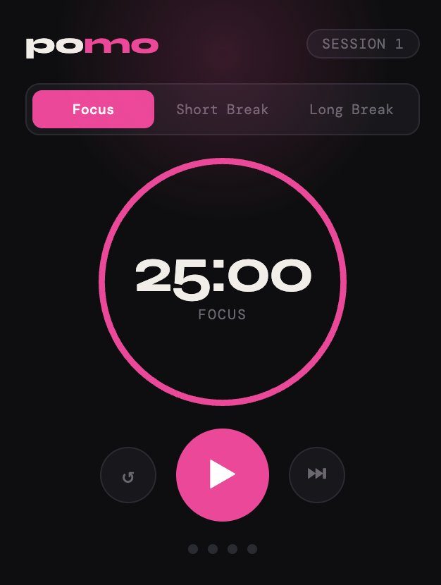

# Pomo — Pomodoro Timer Chrome Extension

A minimal, beautiful Pomodoro timer extension for Chrome. Built with vanilla HTML, CSS, and JavaScript using Manifest V3.



## Features

- 25 min focus sessions → 5 min short break → 15 min long break every 4 sessions
- Background timer that keeps running even when the popup is closed
- Desktop notifications when a session ends
- Session progress tracking across your 4-session cycle
- Skip, reset, or manually switch modes at any time
- Persistent state — your timer survives closing and reopening Chrome

## Tech

- Vanilla HTML, CSS, JavaScript
- Chrome Extension Manifest V3
- Chrome Alarms API (background timer)
- Chrome Notifications API
- Chrome Storage API (persistent state)

## Installation

### From Source

1. Clone this repo
   ```bash
   git clone https://github.com/faridahc/pomo-extension.git
   ```
2. Open Chrome and go to `chrome://extensions`
3. Enable **Developer Mode** (toggle in the top right)
4. Click **Load unpacked** and select the `pomodoro-extension` folder
5. Click the puzzle piece icon in Chrome's toolbar and pin **Pomo**

## How It Works

The extension uses Chrome's Alarms API to tick every second in the background via a service worker (`background.js`). This means the timer keeps running accurately even when the popup is closed. State is saved to Chrome's local storage so nothing is lost between sessions.

When a focus session ends, the service worker automatically queues the next break (or focus session) and fires a desktop notification.

## Project Structure

```
pomodoro-extension/
├── manifest.json      # Extension config (Manifest V3)
├── background.js      # Service worker — timer logic & state
├── popup.html         # UI — timer display, controls, mode tabs
└── icons/
    ├── icon16.png
    ├── icon48.png
    └── icon128.png
```

## License

MIT
